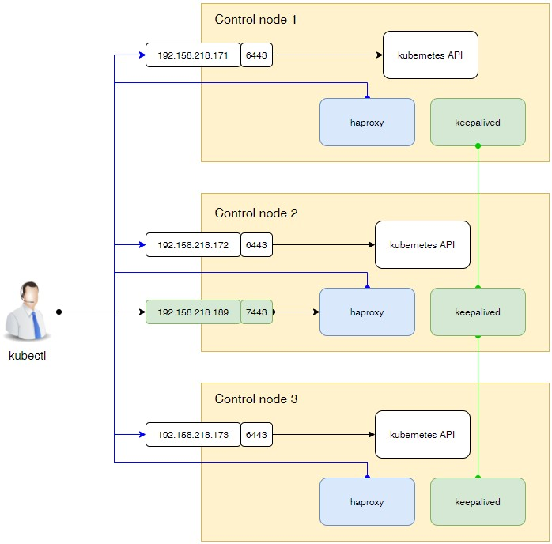

# Ansible playbook для установки тестового кластера k8s

В данный момент поддерживает:

* Версия Kubernetes 1.28.2
* Дтсьрибутив симейства RedHat
* Установку одной или несколько control nodes.
* HA доступ к API kubernetes.
* containerd.
* calico.
* В KubeProxyConfiguration установлены параметры для работы Metallb.
* nodelocaldns - кеширующий DNS сервер на каждой ноде кластера.

Не оттестировано на дистрибутивах Debian.

## Установка ansible

Так получилось, что у меня в WSL2 стоит Ubuntu:

```shell
apt install python3.10-venv
python3 -m venv venv
. ~/venv/bin/activate
python3 -m pip install ansible
```

Генерируем ssh ключ:

```shell
ssh-keygen
или
ssh-keygen -t ed25519 -C "name.you@mail.ru"
```

Копируем ключики в виртуальные машины из [hosts.yaml](hosts.yml):

 ```shell
ssh-copy-id root@192.168.53.160 (Control)
ssh-copy-id root@192.168.53.161 (Control)
ssh-copy-id root@192.168.53.162 (Control)
ssh-copy-id root@192.168.53.163 (Worker)
ssh-copy-id root@192.168.53.164 (Worker)
ssh-copy-id root@192.168.53.165 (Worker)
```

## Конфигурационные параметры

* [Инвентори](hosts.yaml).
* [Общая конфигурация](group_vars/k8s_cluster).

## Установка

### k8s с одной control node

В [инвентори](hosts.yaml) в группе `k8s_masters` необходимо указать только один хост.

```shell
ansible-playbook install-cluster.yaml
```

### k8s с несколькими control nodes

В [инвентори](hosts.yaml) в группе `k8s_masters` необходимо указать **нечётное количество
control nodes**.

```shell
ansible-playbook install-cluster.yaml
```

### k8s c HA

Используются haproxy и keepalived.



В конфигурационном файле определите параметры доступа к API :

* `ha_cluster_virtual_ip` - виртуальный IP адрес.
* `ha_cluster_virtual_port` - порт. Не должен быть равен 6443.

## Удалить кластер

```shell
ansible-playbook reset.yaml
```

**Внимание!!!** Скрипт удаляет **все** нестандартные цепочки и чистит все стандартные цепочки.

## Апдейт кластера

Изменяете версию кластера в `group_vars\k8s_cluster` и запускаете апдейт.

```shell
ansible-playbook upgrade.yaml
```

## Сервисные функции

Сервисные функции находятся в директории `services`
